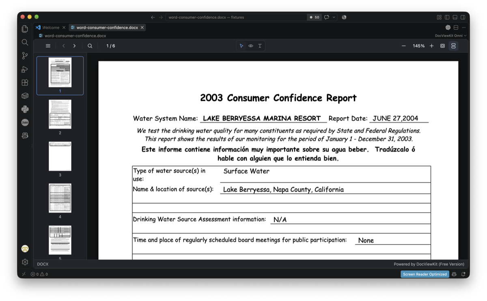
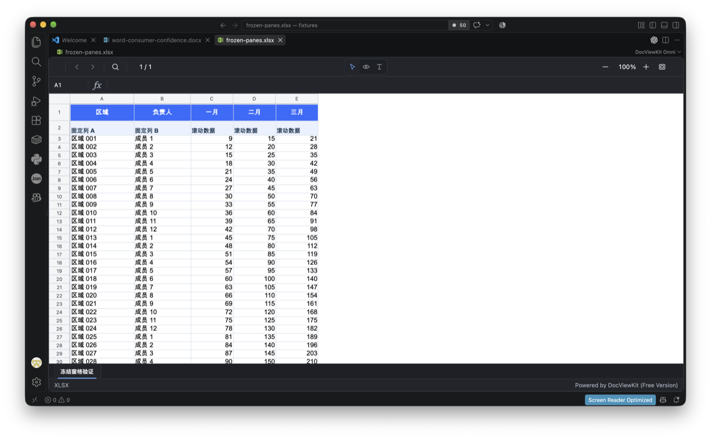
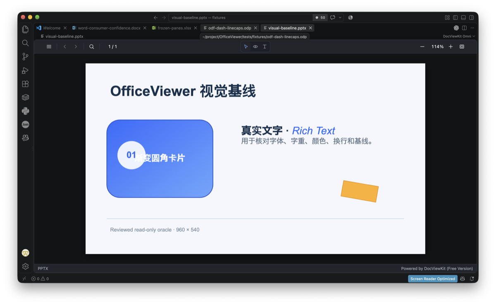
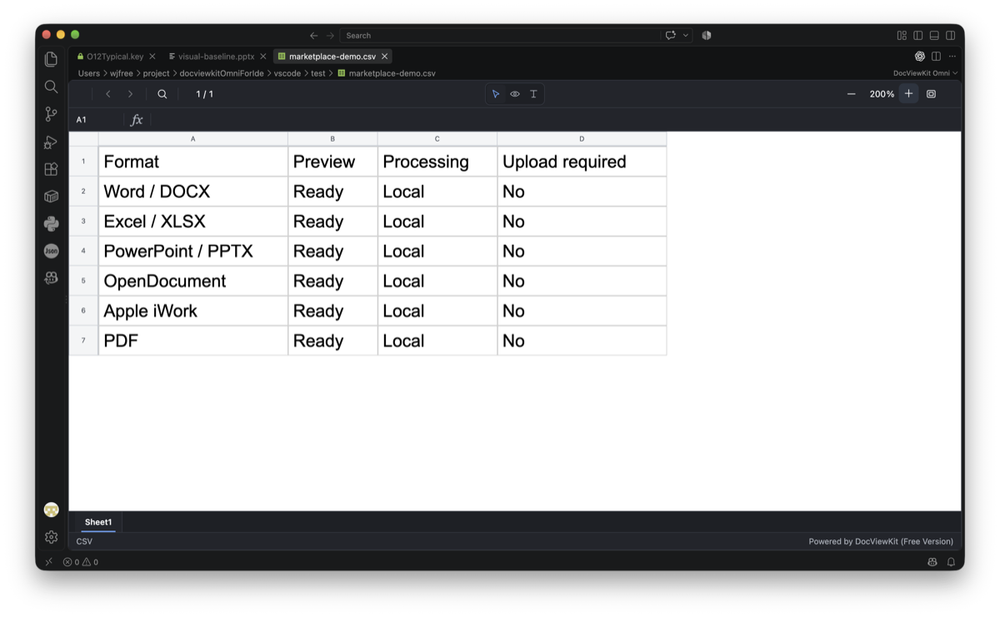

# DocViewKit Omni for VS Code

Preview Office, PDF, OpenDocument, and iWork files without leaving VS Code. Documents stay on your device or IDE-managed remote workspace—no uploads and no conversion server.

| Word document | Excel workbook |
| --- | --- |
|  |  |
| PowerPoint presentation | CSV data |
|  |  |

## Open a document

Open a supported file normally. If another editor is selected, use **Open With… → DocViewKit Omni**.

DocViewKit Omni renders the document in a read-only editor with navigation, zoom, search, text selection, safe hyperlinks, and interaction modes where supported.

## Why DocViewKit Omni?

- **Documents stay private:** parsing, rendering, and search run locally. The extension does not upload documents or send file names and paths to a remote service.
- **No conversion server:** preview files without deploying, maintaining, or trusting a document-conversion backend.
- **Broad format support, free:** view modern and legacy Office, PDF, OpenDocument, Apple iWork, WPS Office, XPS, RTF, and CSV files.
- **Fast and lightweight:** format components load on demand, reducing startup time and resource use.
- **Safe, read-only viewing:** active document content is not executed; isolated object or resource failures do not unnecessarily hide the rest of the document.
- **IDE-native behavior:** files are read through the VS Code workspace API, refresh when they change, follow the active theme and language, and work with local or VS Code remote workspaces.

## Supported formats

Word (`docx`, `docm`, `dotx`, `dotm`, `doc`, `rtf`, `wps`), Excel (`xlsx`, `xlsm`, `xltx`, `xltm`, `xls`, `csv`, `et`), PowerPoint (`pptx`, `pptm`, `ppsx`, `ppsm`, `potx`, `potm`, `ppt`, `dps`), OpenDocument (`odt`, `ott`, `fodt`, `ods`, `ots`, `fods`, `odp`, `otp`, `fodp`), iWork (`pages`, `numbers`, `key`), PDF, XPS, and OXPS.

The free Viewer includes every available format and retains DocViewKit branding. DocViewKit Omni is powered by [DocViewKit Viewer](https://docviewkit.com/).

[Privacy Policy](https://docviewkit.com/privacy/docviewkit-omni/) · [End User License Agreement](https://docviewkit.com/license/docviewkit-omni/) · [Report an issue](https://github.com/docviewkit/docviewkit-omni-ide/issues)
